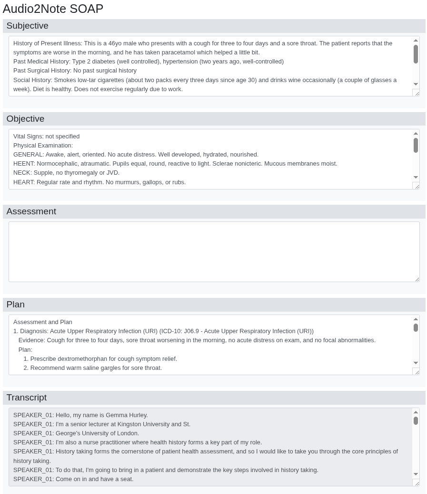
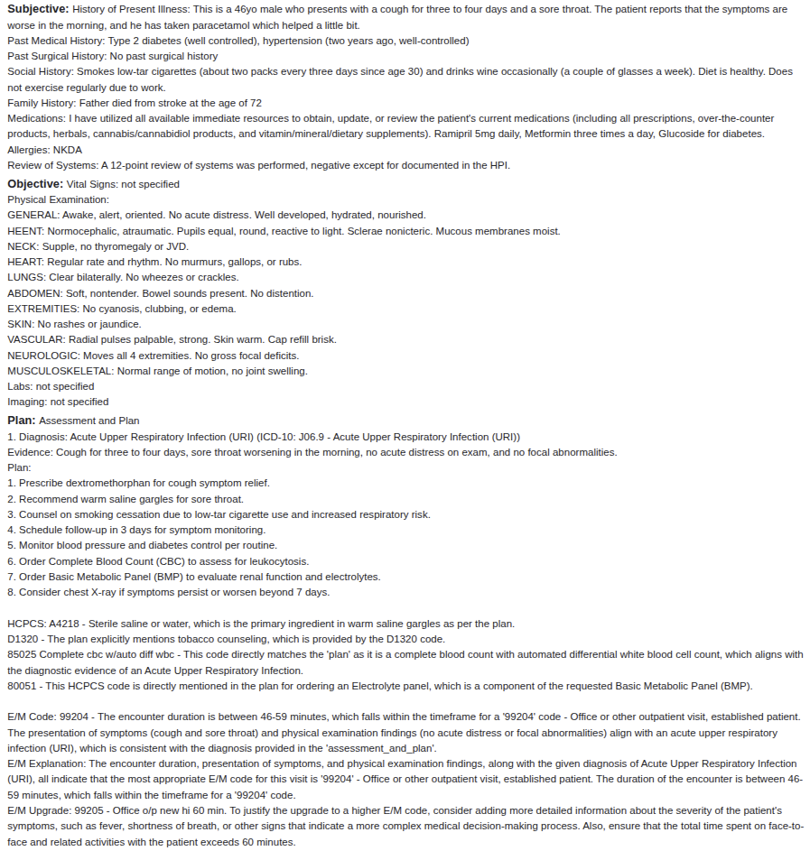
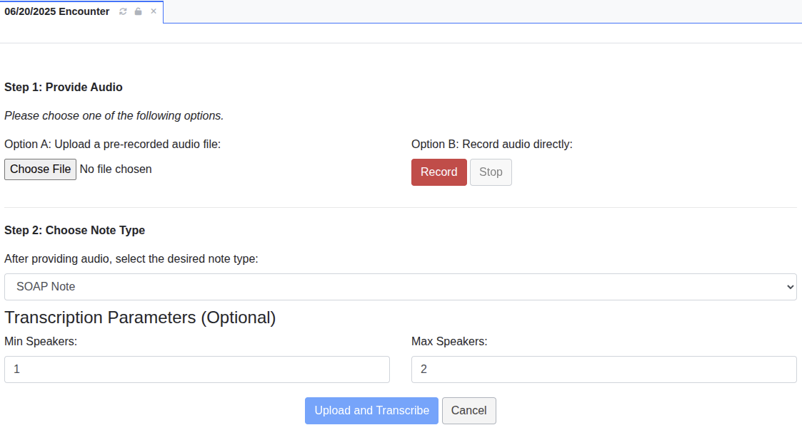

# Notin for OpenEMR

[](https://github.com/SunPCSolutions/Notin)
[](https://www.open-emr.org)
[](https://github.com/SunPCSolutions/Notin)
[](https://github.com/SunPCSolutions/Notin/blob/main/LICENSE)

## Overview

This repository contains the official OpenEMR module for the **[Notin Service](https://github.com/SunPCSolutions/Notin)**. It is a powerful tool for healthcare professionals using OpenEMR, designed for Internal Medicine and related subspecialties, but with a modular design for future expansion.

This module streamlines the clinical documentation process by allowing you to convert audio recordings from patient encounters into structured clinical notes directly within the patient's chart.

## What It Does

*   **Audio to Note:** Upload an audio file of your patient encounter, and the module will automatically generate a custom **Notin SOAP Note** or a **History and Physical Note**, complete with suggested ICD-10, CPT, and E/M codes.

    

    *Example of a generated SOAP Note.*

    

    *Example of a generated SOAP Note as seen on main encounter page.*
    
    
    *Example of a generated History and Physical Note.*

*   **Chart Summarization:** Quickly get up to speed on a patient by generating a summary of their three most recent clinical notes.

    
    *Generate a summary of recent clinical notes.*

*   **Seamless Integration:** The generated notes are automatically filed into the correct patient's chart, with real-time status updates on the progress of your note.

    
    *Real-time update showing the note is being processed.*

## How It Works

1.  **Navigate to Notin:** From within a patient encounter, navigate to `Clinical` --> `Notin`.

    

2.  **Provide Audio & Choose Note Type:** You can either upload a pre-recorded audio file or record one in real-time. Then, select the type of note you want to generate.

    

3.  **Generate Note:** Click "Upload and Transcribe." The note will be automatically populated in the appropriate chart when processing is complete.

## Why Use Notin?

*   **Physician-Led Development:** The module is actively used and improved by a practicing physician, ensuring it meets the real-world needs of clinicians.
*   **Reliable Data:** The AI models use custom datasets produced from peer-reviewed sources.
*   **Privacy-Focused:** We use self-hosted software and small-scale AI models, meaning your information does not leave our servers.
*   **Secure by Design:** Sensitive data is protected with strong encryption (ChaCha20-Poly1305) and PHI is securely erased from our servers after processing.
*   **Open and Extensible:** The module is built on open-source software and is designed to be modular.

## Installation

### Step 1: Obtain a License

First, obtain a license from our website: **[https://www.notin.ai](https://www.notin.ai)**

A 10-day free trial period is included with every license. You will receive a **License Key**, **API Consumer Key**, and **API Consumer Secret** required to activate the module.

### Step 2: Install the Module

1.  **Decompress Files:** Place the `openemrNotin_installer.tar.gz` package into your OpenEMR webroot directory (e.g., `/var/www/html/openemr/`). Then, from within that directory, run the following command:

    ```bash
    tar -xzvf openemrNotin_installer.tar.gz
    ```

2.  **Finalize Installation:** Open your web browser and navigate to the installer script at `https://<your_openemr_url>/install.php`. Follow the on-screen instructions.

3.  **Activate and Configure:**
    *   In OpenEMR, navigate to `Modules -> Manage Modules` and activate the "Notin" module.
    *   Go to `Modules -> Notin -> Settings` to enter your license and API keys.
    *   Go to `Admin -> Forms -> Forms Administration` and enable forms audio_to_note, history_physical, recent_visit_summary, and soap_audio

## Legal Disclaimer

This module is a clinical documentation aid. By using this module, you agree to the terms and conditions outlined in our [Legal Disclaimer](docs/Legal%20Disclaimer%20for%20Notin%20Module.md).

## Contributing

This module is designed to be a robust and seamless bridge between OpenEMR and the Notin service. If you are interested in contributing, please reach out via our main project's [Contact Form](https://www.notin.ai/?page_id=136).
